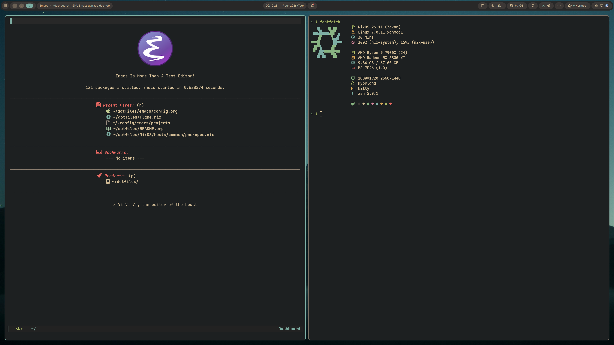

#+TITLE: drishal's dotfiles
#+OPTIONS: toc:nil

* Table of Contents :toc:
- [[#welcome][Welcome!]]
- [[#whats-inside][What's inside]]
- [[#repository-layout][Repository layout]]
- [[#the-nix-flake][The Nix flake]]
  - [[#hosts][Hosts]]
  - [[#how-the-modules-fit-together][How the modules fit together]]
- [[#literate-org-configs][Literate org configs]]
- [[#setup-on-nixos][Setup on NixOS]]
  - [[#first-time-install][First-time install]]
  - [[#day-to-day][Day to day]]
- [[#non-nixos--standalone-configs][Non-NixOS / standalone configs]]
- [[#screenshot][Screenshot]]

* Welcome!
So you went searching for a way to configure /something/, fell down a rabbit
hole of tutorials, and somehow ended up here staring at a wall of files with no
idea what's going on.

Don't worry — this README exists precisely to tackle that. These are my personal
dotfiles, built around *NixOS + Home Manager flakes*, with a pile of standalone
configs for window managers, terminals, editors and shells kept around for
reference (and the occasional non-Nix machine).

*Note:* a lot of paths are hard-coded to =~/dotfiles=. Clone it there.

* What's inside
- *NixOS system + Home Manager configs* — a flake driving three machines
  (=flake.nix= and everything under =NixOS/=).
- *Window managers* — Hyprland, Sway, river, qtile, awesome, xmonad, leftwm, and
  the suckless stack (dwm, dwl, dmenu, st, dwmblocks) under =suckless/=.
- *Terminals* — Alacritty, Kitty, Ghostty, foot, st.
- *Editors* — Emacs (literate, see =emacs/=), Neovim (via nixvim + a standalone
  =config/nvim=), Doom Emacs (=config/doom.d=), Helix.
- *Shells* — zsh, fish, starship, tmux — several written as literate org files.
- *Bars / launchers / notifs* — waybar, polybar, xmobar, rofi, dunst, conky,
  DankMaterialShell (dms), ags, deadd.
- *Theming* — system-wide via [[https://github.com/nix-community/stylix][Stylix]] (base16), plus a folder of wallpapers.
- *Scripts* — assorted helpers under =scripts/= (Nix updates, dotfile sync, GPU
  watch, power monitoring, etc.).

* Repository layout
#+begin_src
dotfiles/
├── flake.nix                # entry point: inputs + nixos/home configurations
├── flake.lock
├── NixOS/                   # all Nix code
│   ├── hosts/              # NixOS system configs (per-machine)
│   │   ├── common/        # shared system modules (base, nix, users, gui, ...)
│   │   │   ├── cpu/       # amd-pstate / intel-pstate
│   │   │   ├── graphics/  # amd / nvidia
│   │   │   └── scheduler/ # sched-ext: lavd / bpfland
│   │   ├── nixos/         # AMD laptop
│   │   ├── nixos-desktop/ # AMD desktop
│   │   └── nixos-work/    # Intel + Nvidia work machine
│   ├── home/               # Home Manager configs (per-machine)
│   │   ├── common/        # shared user modules (shells, editors, desktop, ...)
│   │   ├── nixos-desktop/
│   │   └── nixos-work/
│   ├── shared/             # modules shared by both system + home (stylix)
│   └── pkgs/               # custom/overridden packages (thorium, galaxy-buds)
├── emacs/                   # literate Emacs config + themes
├── config/                  # standalone (non-Nix) app configs
├── suckless/                # dwm / dwl / st / dmenu sources + patches
├── scripts/                 # helper scripts
└── wallpapers/
#+end_src

* The Nix flake
Everything is driven from =flake.nix=, which exposes two sets of outputs:

- =nixosConfigurations= — the system-level config for each host.
- =homeConfigurations= — the standalone Home Manager config for each host
  (=<user>@<host>=).

Notable inputs: =nixpkgs= (unstable) + =nixpkgs-master=, =home-manager=,
=nixvim=, =stylix=, =chaotic= (nyx), =hyprland=, =emacs-overlay=, =nix-gaming=,
=ghostty=, =zen-browser=, =betterfox=, =dms=, and a private flake at
=~/.private-stuff= for secrets/email.

** Hosts
| Host          | Role         | CPU          | GPU    | Notable extras                    |
|---------------+--------------+--------------+--------+-----------------------------------|
| =nixos=         | AMD laptop   | (default)    | AMD    | memory + storage tuning           |
| =nixos-desktop= | AMD desktop  | amd-pstate   | AMD    | lavd scheduler, Jellyfin          |
| =nixos-work=    | Work machine | intel-pstate | Nvidia | bpfland scheduler, virtualisation |

** How the modules fit together
The flake composes each machine from layered =imports=:

- =NixOS/hosts/common/default.nix= pulls in the shared system modules
  (=base=, =nix=, =gui=, =packages=, =users=, =virtualisation=, =searx=, …).
- Each host's =default.nix= imports =../common= and then layers on its own
  hardware bits (the right =cpu/=, =graphics/=, =scheduler/= module plus its
  generated =hardware-configuration.nix=).
- The same pattern repeats for Home Manager: =NixOS/home/common= is shared, and
  each host's home dir adds machine-specific tweaks.

So adding a new machine ≈ create a =hosts/<name>/= dir, drop in its hardware
config, pick a CPU/GPU/scheduler module, and register it in =flake.nix=.

* Literate org configs
Several configs are written as *literate org-mode* files that tangle to their
real destinations on save:

- =emacs/config.org=  → =~/.config/emacs/init.el= (+ =early-init.el=)
- =config/zshrc.org=  → =~/.zshrc=
- =config/fish/config.org= → =~/.config/fish/config.fish=

Open the =.org=, read the prose, edit the =src= blocks, and let org-babel tangle
the output. (The NixOS config itself is deliberately *not* literate — see the
modular layout above.)

* Setup on NixOS
Clone the repo to =~/dotfiles= first — paths depend on it:
#+begin_src bash
git clone <this-repo> ~/dotfiles
#+end_src

** First-time install
Generate hardware config for the machine and place it under the matching host
dir (=NixOS/hosts/<host>/hardware-configuration.nix=), then build the system —
substitute your host name (=nixos=, =nixos-desktop=, or =nixos-work=):
#+begin_src bash
sudo nixos-rebuild switch --flake ~/dotfiles#nixos -L
#+end_src

Bootstrap Home Manager the first time:
#+begin_src bash
nix run --no-write-lock-file --impure github:nix-community/home-manager -- \
  switch --flake ~/dotfiles#drishal@nixos
#+end_src

** Day to day
#+begin_src bash
# rebuild the system
sudo nixos-rebuild switch --flake ~/dotfiles#nixos -L

# rebuild the user environment
home-manager switch --flake ~/dotfiles#drishal@nixos

# update inputs (see scripts/ for helpers)
nix flake update --flake ~/dotfiles
#+end_src

If you omit the =#<host>= selector, Nix tries to match the current hostname.

* Non-NixOS / standalone configs
The =config/=, =suckless/= and =emacs/= trees are plain dotfiles and work on any
distro — symlink (or stow) the ones you want into place. The suckless programs
ship with their sources and patches, so build them with =make && sudo make
install= inside each directory.

* Screenshot
#+CAPTION: Hyprland + NixOS

