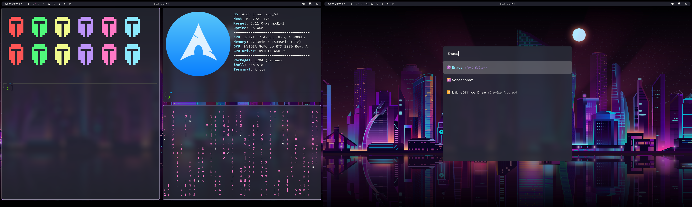
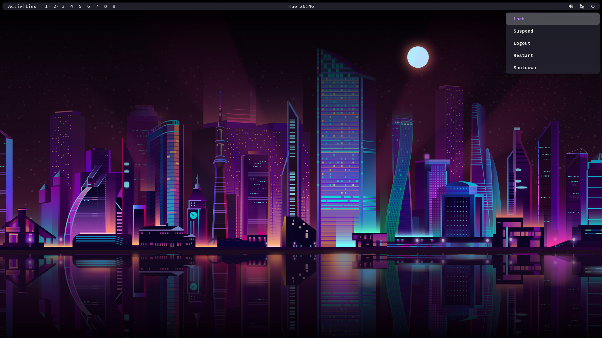
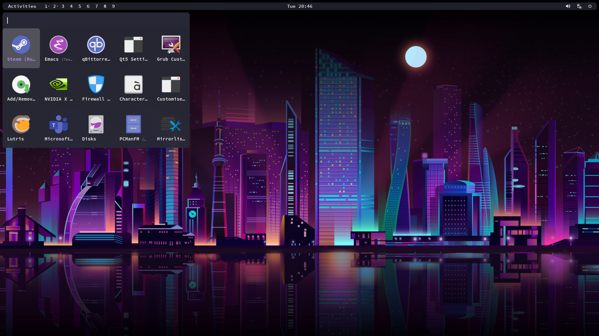
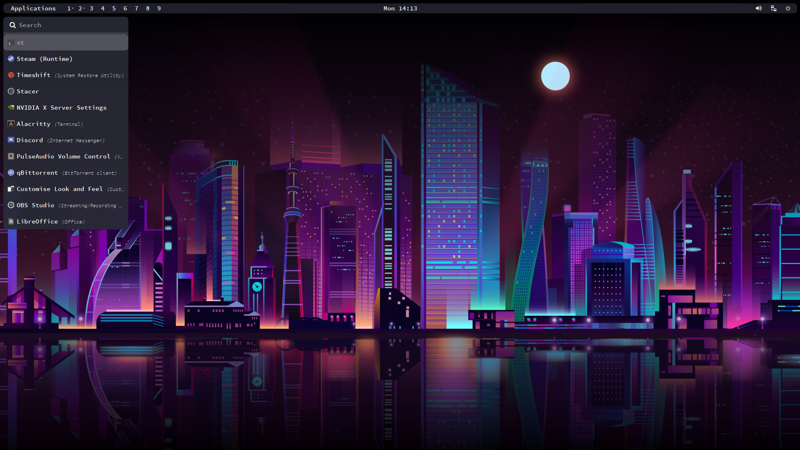

# Dracula Rounded

## Packages

```
DE          : Arch
WM          : Leftwm
terminal    : Alacritty/st
colorscheme : Dracula
bar         : Polybar
launcher    : Rofi
```

## Screenshot






## Dependencies

- [leftwm-git](https://github.com/leftwm/leftwm)
- [ibhagwan picom](https://github.com/ibhagwan/picom)
- [polybar](https://github.com/polybar/polybar)
- [saucecodepro nerd font](https://github.com/ryanoasis/nerd-fonts)
- [rofi](https://github.com/davatorium/rofi)

## Installation

1. Install all required dependencies

2. Clone the repository

```BASH
git clone https://github.com/AethanFoot/leftwm-theme-dracula-rounded.git
```

3. Make a copy of this project in your themes folder

```BASH
cp -r ./leftwm-theme-dracula-rounded ~/.config/leftwm/themes
```

4. Remove the symlink to your current theme if set

```BASH
rm ~/.config/leftwm/themes/current
```
5. Set this as your current theme

```BASH
ln -s ~/.config/leftwm/themes/leftwm-theme-dracula-rounded ~/.config/leftwm/themes/current
```

6. Restart your window manager

```Default shortcut
$MOD + Shift + r
```

## Configuration

There are two launchers that can be used, list and touch. You can switch between these by linking either to the file launcher.rasi e.g.:
```BASH
ln -s list_launcher.rasi launcher.rasi
```

## Credits

The polybar theme is a modified panel created by adi1090x(https://github.com/adi1090x/polybar-themes)
